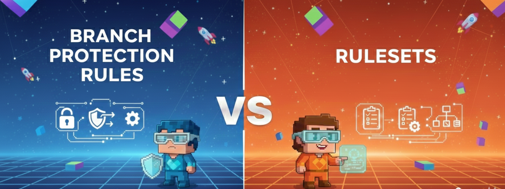

# Latest Tech Articles:

    

        
    

    

        <h3 class="publication-title">
            <a href="https://dev.to/piyushgaikwaad/branch-protection-rules-vs-rulesets-the-right-way-to-protect-your-git-repos-305m" class="publication-link">
                Branch Protection Rules vs Rulesets: The Right Way to Protect Your Git Repository.
            </a>
        </h3>
    

    

        
    

    

        <h3 class="publication-title">
            <a href="https://dev.to/piyushgaikwaad/how-to-enforce-policies-without-blocking-hotfixes-7dh" class="publication-link">
                How to Enforce Policies Without Blocking Hotfixes.
            </a>
        </h3>
    

